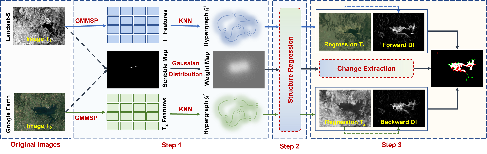

# SG-SRF: Scribble-Guided Structural Regression Fusion for Multimodal Change Detection

This is the official MATLAB implementation of our IEEE GRSL paper:

> **Scribble-Guided Structural Regression Fusion for Multimodal Remote Sensing Change Detection**  
> Yongjie Zheng, Sicong Liu, Lorenzo Bruzzone  
> Accepted in IEEE Geoscience and Remote Sensing Letters (GRSL), 2025

[[📰 Paper Link (IEEE Xplore)](https://doi.org/10.1109/LGRS.2025.3575620))]  
[[📌 Dataset Download (Baidu Cloud)](https://pan.baidu.com/s/1vdalarK-yhjok0doT-zehw?pwd=b9jg)]  
🔑 Extraction Code: `b9jg`

---

<p align="center">
  
</p>

<p align="center"><b>Figure:</b> Overview of the proposed SG-SRF framework.</p>

---

## Highlights

- ✔️ Weakly-supervised change detection using sparse scribbles
- ✔️ Works for both multimodal (SAR-Optical) and homogeneous image pairs
- ✔️ Combines hypergraph-based structure modeling with scribble guidance
- ✔️ Outperforms prior unsupervised/weakly-supervised CD methods

---

## Project Structure

SG-SRF-main/
├── SG_SRF_demo.m                        # Main experiment script (full pipeline)
├── Abs_scribbles_SG_SRF_demo.m         # Ablation study: different scribble sparsity
├── Abs_superpixels_SG_SRF_demo.m       # Ablation study: different superpixel counts
├── auxi_funcs/                          # All utility functions (regression, Laplacian, metrics, etc.)
├── GC/                                  # Graph-cut / MRF-related modules
├── GMMMSP-superpixel-master/           # GMM superpixel code (for segmentation)
├── datasets/                            # Example dataset(s) (Dataset#1 included)
├── LICENSE                              # MIT License
└── README.md                            # Project description


---

## Acknowledgements

This work is an extension and improvement of the Structural Regression Fusion (SRF) framework proposed by Yuli Sun et al..  
For more details, please refer to the original SRF repository:

🔗 https://github.com/yulisun/SRF

---

## Citation

If you find this code useful, please cite these papers:

```bibtex
@article{zheng2025scribble,
  title={Scribble-Guided Structural Regression Fusion for Multimodal Remote Sensing Change Detection},
  author={Zheng, Yongjie and Liu, Sicong and Bruzzone, Lorenzo},
  journal={IEEE Geoscience and Remote Sensing Letters},
  year={2025}
}

@article{SunStructural2023,
  author={Sun, Yuli and Lei, Lin and Liu, Li and Kuang, Gangyao},
  title={Structural Regression Fusion for Unsupervised Multimodal Change Detection},
  journal={IEEE Transactions on Geoscience and Remote Sensing},
  year={2023}
}


